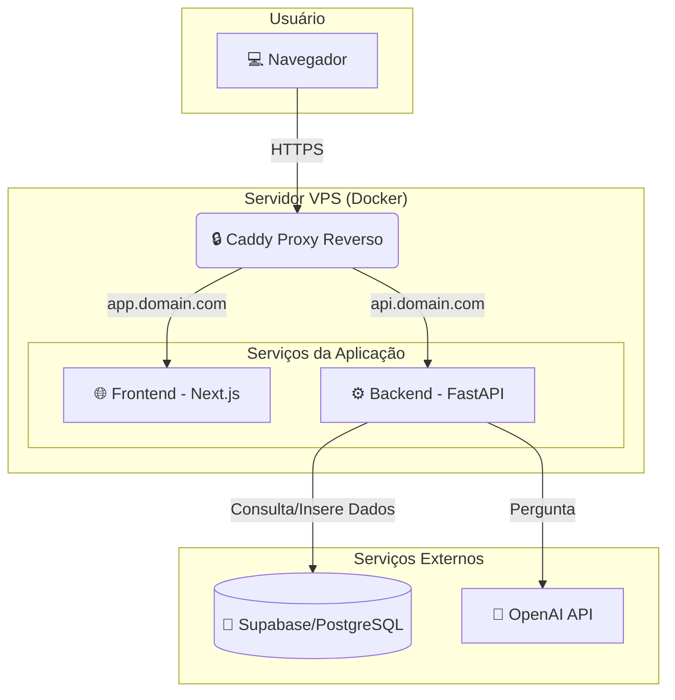

# IaAndData - Assistente Inteligente para Análise do Mercado Financeiro

 <!-- Adicionar um banner visual aqui -->

## 📜 Visão Geral

O **IaAndData** é um sistema de análise de dados do mercado financeiro brasileiro, potencializado por um agente de Inteligência Artificial conversacional. A plataforma permite que usuários façam perguntas em linguagem natural sobre dados históricos de ações da B3 e recebam respostas precisas, incluindo visualizações de dados complexos como gráficos de séries temporais e cones de volatilidade.

Construído com uma arquitetura moderna, containerizada e pronta para produção, o projeto serve como uma poderosa ferramenta para investidores, analistas e estudantes que buscam extrair insights quantitativos do mercado de ações sem a necessidade de conhecimento técnico em programação ou análise de dados.

---

## 🚀 A Jornada do Projeto

Este projeto nasceu de um desafio técnico simples: corrigir um `Internal Server Error 500` em uma API que retornava valores numéricos inválidos (`NaN`). No entanto, a visão rapidamente se expandiu. A jornada de desenvolvimento transformou uma simples API em um ecossistema completo:

1.  **Da Correção à Conversação:** A necessidade de interações mais ricas levou à criação de um agente de IA com memória, capaz de entender o contexto e responder a perguntas de acompanhamento.
2.  **Da Ambiguidade à Precisão:** O desafio de lidar com perguntas ambíguas (ex: "dados de 18/09") foi um ponto de virada. A solução evoluiu de tentativas de adivinhação pela IA para uma robusta camada de validação na API, forçando a clareza e garantindo a precisão dos dados.
3.  **Do Conhecimento Limitado à Autoconsciência:** A IA inicialmente não sabia a extensão dos dados que possuía. Foi criada uma ferramenta de introspecção (`list_available_tickers`) que permite ao agente consultar seu próprio banco de dados e informar ao usuário exatamente quais ações ele conhece.
4.  **Do Generalista ao Especialista:** Para evitar "alucinações" e respostas genéricas, a personalidade da IA foi estritamente definida. Ela agora atua como uma **analista de dados históricos**, recusando-se a fazer previsões e guiando ativamente os usuários a fazerem perguntas que ela pode responder com excelência.
5.  **Do Local à Nuvem:** O projeto foi totalmente containerizado com Docker e orquestrado com Docker Compose. Um proxy reverso Caddy foi configurado para gerenciar o tráfego e fornecer HTTPS automaticamente, e scripts de automação (`install.sh`, `update.sh`) foram criados para facilitar o deploy e a atualização em um servidor Ubuntu virgem.

O resultado é um sistema que não apenas funciona, mas é robusto, escalável, seguro e fácil de manter.

---

## 🎯 Utilidade e Casos de Uso

*   **Investidores de Varejo:** Obter rapidamente dados históricos de preços e volumes sem navegar por plataformas complexas.
*   **Estudantes de Finanças:** Utilizar a ferramenta para estudos acadêmicos sobre volatilidade, correlação e performance de ativos.
*   **Analistas Financeiros:** Acelerar a coleta de dados quantitativos para relatórios e análises mais profundas.
*   **Entusiastas de Tecnologia:** Explorar uma implementação prática de um sistema baseado em LLM com ferramentas, memória e uma arquitetura de microsserviços.

---

## ✨ Funcionalidades Detalhadas

### 1. Backend (API FastAPI)
- **Endpoint de Análise de Intraday:** Rota (`/intraday/{ticker}`) otimizada para fornecer dados de alta frequência para gráficos em tempo real.
- **Endpoint de Agente Conversacional:** Rota principal (`/api/v1/query`) que processa as perguntas em linguagem natural.
- **Validação de Datas Ambíguas:** Uma camada de pré-processamento que intercepta perguntas com datas incompletas (ex: "DD/MM") e solicita ao usuário que especifique o ano, garantindo a precisão das consultas.
- **Suporte a CORS:** Configurado para permitir requisições seguras do frontend de produção.

### 2. Frontend (Next.js & Chart.js)
- **Interface de Chat Moderna:** UI limpa e reativa para a interação com o agente.
- **Histórico de Conversa por Sessão:** Cada usuário tem uma sessão única, permitindo que o agente se lembre do contexto das perguntas anteriores.
- **Visualização de Gráficos Dinâmicos:** Renderiza automaticamente gráficos de linha (séries temporais) e gráficos complexos como o Cone de Volatilidade.
- **Gráfico de Intraday em Tempo Real:** Um componente otimizado que busca dados a cada 15 segundos, mas que inteligentemente pausa as atualizações quando não está visível para economizar recursos.
- **Configuração via Variáveis de Ambiente:** A URL da API é configurada dinamicamente, facilitando a transição entre ambientes de desenvolvimento e produção.

### 3. Agente de IA (LangChain & GPT-4o-mini)
- **Personalidade e Escopo Definidos:** O agente atua estritamente como um especialista em dados históricos da B3. Ele é programado para não responder a perguntas sobre previsões ou recomendações de investimento, guiando o usuário a fazer perguntas quantitativas.
- **Consciência Temporal:** O agente é sempre "informado" sobre a data e hora atuais a cada interação, permitindo que ele interprete corretamente termos como "hoje", "ontem" e "semana passada".
- **Ferramentas de Análise (Tools):**
  - `get_stock_data`: Busca dados históricos de uma ação (OHLCV).
  - `get_volatility_cone`: Calcula e projeta a volatilidade de uma ação, criando um "cone de incerteza".
  - `get_market_summary`: Calcula o volume financeiro total negociado na B3 em um dia específico.
  - `get_top_stocks_by_criteria`: Cria rankings das ações com maior volume ou volume financeiro em um período.
  - `list_available_tickers`: Consulta o banco de dados para listar todas as ações sobre as quais possui conhecimento.
- **Raciocínio Inteligente:** Capaz de inferir que a ausência de dados em uma data específica provavelmente se deve a um fim de semana ou feriado, informando isso ao usuário.

### 4. Pipeline de Dados (ETL)
- **Extração Abrangente:** Um script (`etl/extracao.py`) utiliza a biblioteca `yfinance` para buscar anos de dados históricos de mais de 80 tickers do índice Ibovespa.
- **Armazenamento Robusto:** Os dados são carregados em um banco de dados PostgreSQL gerenciado pelo Supabase, garantindo performance e escalabilidade.

### 5. Infraestrutura e Deploy (Docker & Caddy)
- **Containerização Completa:** Backend, Frontend e o Proxy Reverso rodam em contêineres Docker isolados, garantindo consistência entre os ambientes.
- **Orquestração com Docker Compose:** Um único arquivo (`docker-compose.yml`) gerencia toda a stack de serviços.
- **Proxy Reverso com Caddy:** O Caddy atua como porta de entrada da aplicação, distribuindo o tráfego para o frontend e backend e, mais importante, **gerenciando automaticamente a geração e renovação de certificados SSL (HTTPS)**.
- **Scripts de Automação:**
  - `install.sh`: Prepara um servidor Ubuntu virgem, instalando Docker, Docker Compose e configurando as permissões necessárias.
  - `update.sh`: Automatiza o processo de atualização em produção, puxando as últimas alterações do Git, reconstruindo as imagens Docker e reiniciando os serviços.

---

## 🏗️ Arquitetura do Sistema

---

## 🛠️ Como Executar e Fazer o Deploy

### Executando Localmente
1.  **Pré-requisitos:** Git, Python 3.10+, Node.js 18+, Docker e Docker Compose.
2.  **Clone o repositório:** `git clone https://github.com/SolarisSy/IaAndData.git`
3.  **Configure as Variáveis de Ambiente:** Renomeie `.env.example` para `.env` e preencha com suas chaves da OpenAI e Supabase.
4.  **Execute o ETL:** Navegue para a pasta `etl` e execute `python extracao.py` para popular o banco de dados.
5.  **Suba a Stack:** Na raiz do projeto, execute `docker compose up --build`.
6.  Acesse `http://localhost:3000`.

### Deploy em Produção (VPS Ubuntu)
1.  **DNS:** Aponte os registros A de `app.seudominio.com` e `api.seudominio.com` para o IP da sua VPS.
2.  **Clone o repositório na VPS:** `git clone https://github.com/SolarisSy/IaAndData.git`
3.  **Configure os arquivos:**
    *   Crie o arquivo `.env` com as chaves de produção.
    *   Edite o `Caddyfile` com seus domínios e email.
4.  **Execute o Script de Instalação:** `sudo chmod +x install.sh && sudo ./install.sh`.
5.  **Primeiro Deploy:** `sudo docker compose up --build -d`.

### Atualizando em Produção
- Para puxar as últimas atualizações do repositório e reconstruir os contêineres, basta executar: `sudo chmod +x update.sh && sudo ./update.sh`.

---

## 💻 Tecnologias Utilizadas

- **Backend:** Python, FastAPI, LangChain, Pandas
- **Frontend:** Next.js, React, TypeScript, Chart.js, Tailwind CSS
- **IA:** OpenAI (GPT-4o-mini)
- **Banco de Dados:** PostgreSQL (via Supabase)
- **Infraestrutura:** Docker, Docker Compose, Caddy
- **Fonte de Dados:** yfinance
